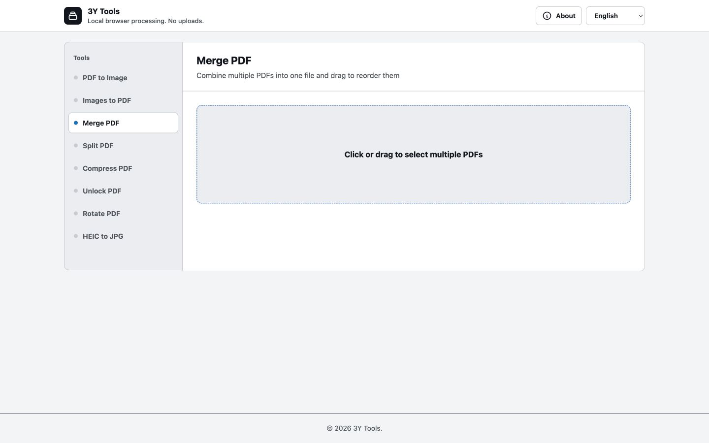

# 3Y Toolbox (YYPDFTools)

<p align="center">
  <strong>A privacy-first PDF, image, and video toolbox that runs entirely in your browser</strong>
</p>

<p align="center">
  <a href="README.md">繁體中文</a> ｜ English ｜ <a href="README.ja.md">日本語</a>
</p>

<p align="center">
  
  
  
</p>



## Overview

3Y Toolbox is a single-page collection of PDF, image, and video utilities. Selected files remain on the user's device: conversion, merging, compression, trimming, and output generation are performed by JavaScript inside the browser, with no file upload to a backend server.

It works well for quick everyday document tasks and can be deployed as a static site. The interface supports Traditional Chinese, English, and Japanese, and automatically follows the operating system's light or dark color preference.

## Features

| Tool | What it does | Output |
| --- | --- | --- |
| PDF to Image | Converts every PDF page to JPG or PNG | Images or ZIP |
| Images to PDF | Combines multiple JPG/PNG images into one document | PDF |
| Merge PDF | Combines PDFs with drag-to-reorder support | PDF |
| Split PDF | Simple two-part or page-by-page splitting, plus page previews and custom multi-range outputs | PDF or ZIP |
| Compress PDF | Rasterizes pages and rebuilds the PDF at a selected image quality | PDF |
| Unlock PDF | Uses a known password to rebuild an unprotected PDF | PDF |
| Rotate PDF | Rotates every page clockwise by 90°, 180°, or 270° | PDF |
| HEIC to JPG | Converts one or more HEIC/HEIF photos to JPG | JPG |
| Remove Background | Runs local AI removal, then provides erase and restore brushes for refinement | Transparent PNG |
| Video Converter | Converts video to MP4, WebM, MOV, MKV, AVI, TS, GIF, or common audio formats | Video, GIF, or audio |
| Video Compressor | Compresses with quality, resolution, and H.264/H.265/VP9 controls | MP4 or WebM |
| Video Trimmer | Previews a video and extracts a precise time range | MP4 |

Interface highlights:

- Instant Traditional Chinese, English, and Japanese switching
- Drag-and-drop and file-picker input
- Automatic light and dark themes
- Progress indicators, success notifications, and recovery-focused errors
- Visible keyboard focus, semantic tabs, and live status announcements
- Responsive desktop and mobile layouts

## Privacy and Processing Model

All file content is processed in the current browser tab. The project has no upload API and requires no account.

The page loads its frontend libraries from CDNs on first visit, so an internet connection is still required for the initial load. Once those resources are loaded, document processing itself is local. For a fully offline build, download the CDN dependencies listed below and replace their URLs with local paths.

The background removal tool downloads an AI model of about 40 MB on first use. The browser caches the model, and the image itself is never sent to the model host or another server.

The video tools download an FFmpeg WebAssembly core of about 32 MB on the first job. Video data is written only to the browser's temporary in-memory file system and removed after processing.

> [!IMPORTANT]
> **Compress PDF** and **Unlock PDF** rasterize every page before rebuilding the document. This makes browser-only processing possible, but text in the output can no longer be selected or searched. Unlocking only works when you know the original password and the browser PDF engine supports that document.

## How to Use

1. Open the toolbox and choose a tool from the navigation bar.
2. Click the upload area or drag files onto it.
3. Configure the format, page range, image quality, password, or rotation angle when applicable.
4. Start processing; preview the result when the browser supports its format, then download it.

Everything happens on the current device. Large or high-resolution documents may take more time and memory depending on device performance, page count, and image dimensions.

## Use Online

No download or installation is required. Open the hosted version and start using it immediately:

### [Open 3Y Toolbox →](https://yenyuy.github.io/YYPDFTools/)

Your PDFs, images, and videos still remain on your device and are processed locally by the browser. They are never uploaded to a server.

## Technology

- HTML, CSS, and vanilla JavaScript
- [Tailwind CSS](https://tailwindcss.com/) via CDN
- [PDF.js](https://mozilla.github.io/pdf.js/) for reading and rendering PDF pages
- [pdf-lib](https://pdf-lib.js.org/) for creating, merging, splitting, and rotating PDFs
- [JSZip](https://stuk.github.io/jszip/) for multi-file archives
- [FileSaver.js](https://github.com/eligrey/FileSaver.js/) for saving generated files
- [heic-to](https://github.com/hoppergee/heic-to) for HEIC/HEIF conversion
- [IMG.LY background-removal](https://github.com/imgly/background-removal-js) for in-browser ONNX Runtime Web and WebAssembly background removal (AGPL-3.0)
- [ffmpeg.wasm](https://github.com/ffmpegwasm/ffmpeg.wasm) for in-browser video conversion, compression, and trimming

## Project Structure

```text
YYPDFTools/
├── index.html                 # Main application and default entry point
├── background-removal.js     # Automatic removal and manual editor
├── background-removal-core.js # Testable editor utility functions
├── background-removal.css    # Background-removal workspace styles
├── video-tools.js            # Shared FFmpeg engine and three video tools
├── video-tools-core.js       # Testable video command and formatting helpers
├── video-tools.css           # Video workspace styles
├── vendor/ffmpeg/            # Locally hosted ffmpeg.wasm JavaScript wrapper
├── tests/                    # Browser-tool unit tests
├── PRODUCT.md                 # Product direction and design principles
├── README.md                  # Traditional Chinese (GitHub default)
├── README.en.md               # English
├── README.ja.md               # Japanese
└── docs/images/
    ├── yyypdftools-desktop-zh-tw.jpg # Traditional Chinese desktop screenshot
    ├── yyypdftools-desktop-en.jpg    # English desktop screenshot
    └── yyypdftools-desktop-ja.jpg    # Japanese desktop screenshot
```

## Browser Requirements and Limitations

- The latest Chrome, Edge, Firefox, or Safari is recommended.
- Large PDFs can consume significant memory. If the browser tab is terminated, process fewer pages or split the work into batches.
- Encrypted PDF support depends on PDF.js; some encryption methods cannot be unlocked in the browser.
- Rasterized compression is most useful for scanned PDFs and may not reduce text-heavy documents.
- HEIC support depends on browser and decoder compatibility.
- Automatic background removal requires a modern browser with WebAssembly support and downloads its AI model on first use.
- Video processing requires WebAssembly and is generally slower than native FFmpeg. Large files use significant memory; files below 750 MB are recommended.
- The trimmer requires a source format the browser can preview; MP4, WebM, or MOV is recommended.

## Contributing

Issues and pull requests are welcome. When changing features, please verify all three languages, light and dark themes, keyboard behavior, and both desktop and mobile layouts.

---

If you find this project useful, consider giving it a ⭐ on GitHub.
