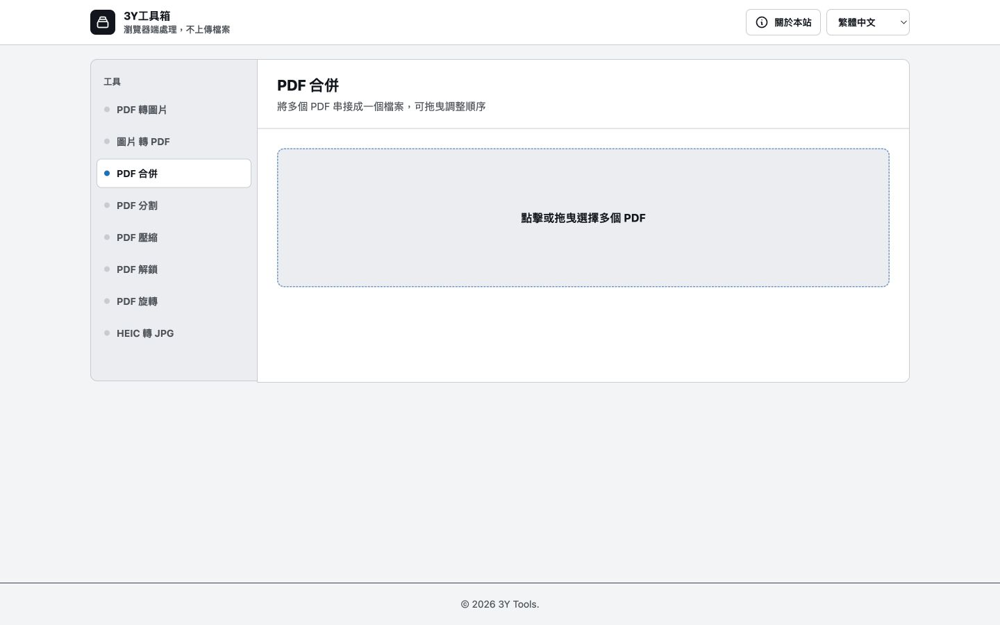

# 3Y 工具箱（YYPDFTools）

<p align="center">
  <strong>隱私優先、完全在瀏覽器中執行的 PDF 與圖片工具箱</strong>
</p>

<p align="center">
  繁體中文 ｜ <a href="README.en.md">English</a> ｜ <a href="README.ja.md">日本語</a>
</p>

<p align="center">
  
  
  
</p>



## 專案簡介

3Y 工具箱是一套單頁式 PDF／圖片處理工具。使用者選取的檔案會留在自己的裝置上，轉換、合併與重新輸出都由瀏覽器端 JavaScript 完成，不需要把文件傳送到後端伺服器。

專案適合快速處理日常文件，也適合直接部署為靜態網站。介面支援繁體中文、英文與日文，並會依作業系統設定自動切換亮色或深色模式。

## 功能

| 工具 | 說明 | 輸出 |
| --- | --- | --- |
| PDF 轉圖片 | 將 PDF 每一頁轉成 JPG 或 PNG | 單張圖片或 ZIP |
| 圖片轉 PDF | 將多張 JPG／PNG 合併為一份 PDF | PDF |
| PDF 合併 | 合併多份 PDF，並可拖曳調整順序 | PDF |
| PDF 分割 | 在指定頁後分成兩份，或將指定範圍逐頁拆分 | PDF 或 ZIP |
| PDF 壓縮 | 將頁面點陣化後，以可選畫質重建 PDF | PDF |
| PDF 解鎖 | 輸入已知密碼後，重建為無密碼 PDF | PDF |
| PDF 旋轉 | 將所有頁面順時針旋轉 90°、180° 或 270° | PDF |
| HEIC 轉 JPG | 將一張或多張 HEIC／HEIF 照片轉為 JPG | JPG |

其他介面特色：

- 繁體中文、English、日本語即時切換
- 拖放與檔案選擇器兩種匯入方式
- 依系統偏好自動套用亮色／深色模式
- 處理進度、成功通知與可復原的錯誤訊息
- 鍵盤焦點、語意化頁籤與動態狀態提示
- 桌面與行動裝置的響應式版面

## 隱私與運作方式

所有檔案內容都在目前的瀏覽器分頁中處理。專案沒有上傳 API，也不需要建立帳號。

頁面第一次載入時會從 CDN 取得前端函式庫，因此首次開啟仍需要網路；資源載入完成後，檔案處理本身在本機進行。若要打造完全離線的版本，可將下方列出的 CDN 相依套件下載並改用本機路徑。

> [!IMPORTANT]
> 「PDF 壓縮」與「PDF 解鎖」會把每一頁轉成影像後重建 PDF。這能在瀏覽器中完成處理，但輸出的文字將無法選取或搜尋。解鎖功能只適用於你已知原始密碼、且瀏覽器 PDF 引擎能讀取的文件。

## 使用方式

1. 開啟工具箱，從上方工具列選擇要執行的功能。
2. 點擊上傳區，或將檔案拖放到頁面中。
3. 依功能設定格式、頁碼範圍、畫質、密碼或旋轉角度。
4. 按下處理按鈕；完成後瀏覽器會下載結果。

所有操作都在目前裝置完成。處理大型或高解析度文件時，所需時間與記憶體會依裝置效能、頁數及影像尺寸而不同。

## 線上使用

無需下載或安裝，直接開啟線上版即可開始使用：

### [立即使用 3Y 工具箱 →](https://yenyuy.github.io/YYPDFTools/)

所有 PDF 與圖片仍會留在你的裝置上，並由瀏覽器在本機完成處理，不會上傳到伺服器。

## 技術組成

- HTML、CSS、原生 JavaScript
- [Tailwind CSS](https://tailwindcss.com/)（CDN）
- [PDF.js](https://mozilla.github.io/pdf.js/)：讀取與繪製 PDF 頁面
- [pdf-lib](https://pdf-lib.js.org/)：建立、合併、分割與旋轉 PDF
- [JSZip](https://stuk.github.io/jszip/)：封裝多檔下載
- [FileSaver.js](https://github.com/eligrey/FileSaver.js/)：儲存瀏覽器產生的檔案
- [heic-to](https://github.com/hoppergee/heic-to)：HEIC／HEIF 轉 JPG

## 專案結構

```text
YYPDFTools/
├── index.html                 # 主要應用程式與預設入口
├── index-layout-v2.html       # 版面設計備選版本
├── PRODUCT.md                 # 產品定位與設計原則
├── README.md                  # 繁體中文（GitHub 預設顯示）
├── README.en.md               # English
├── README.ja.md               # 日本語
└── docs/images/
    ├── yyypdftools-desktop-zh-tw.jpg # 繁體中文桌面版截圖
    ├── yyypdftools-desktop-en.jpg    # 英文桌面版截圖
    └── yyypdftools-desktop-ja.jpg    # 日文桌面版截圖
```

## 瀏覽器需求與限制

- 建議使用最新版 Chrome、Edge、Firefox 或 Safari。
- 大型 PDF 會佔用較多記憶體；若瀏覽器分頁被系統終止，請減少頁數或分批處理。
- 加密 PDF 的支援程度取決於 PDF.js；部分加密方式可能無法在瀏覽器中解鎖。
- 點陣化壓縮較適合掃描型 PDF；以文字為主的 PDF 不一定會變小。
- HEIC 支援取決於瀏覽器對 WebAssembly／影像解碼功能的支援程度。

## 貢獻

歡迎提交 Issue 或 Pull Request。修改功能時，請特別確認三種語言的文案、亮／暗色模式、鍵盤操作，以及桌面與行動版面皆能正常使用。

---

如果這個專案對你有幫助，歡迎在 GitHub 上給它一顆 ⭐。
